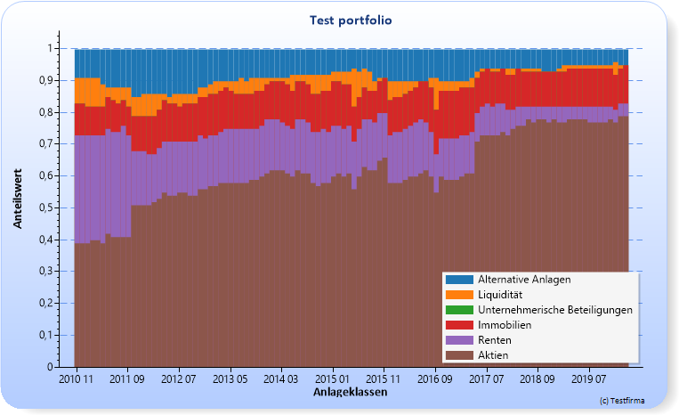
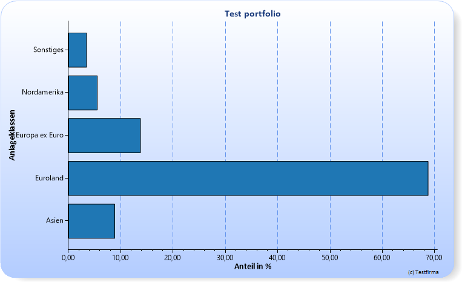
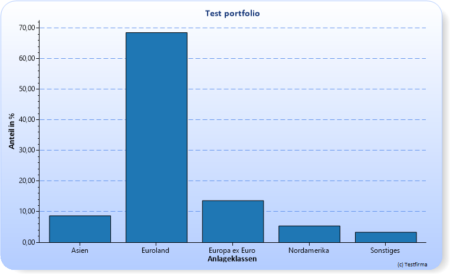
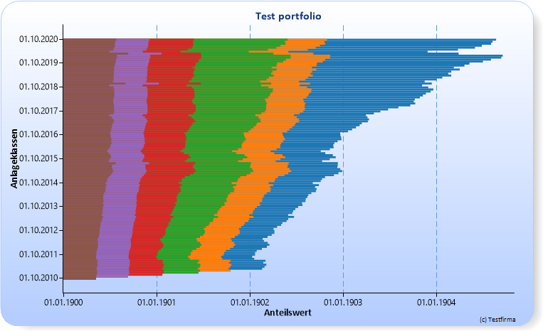
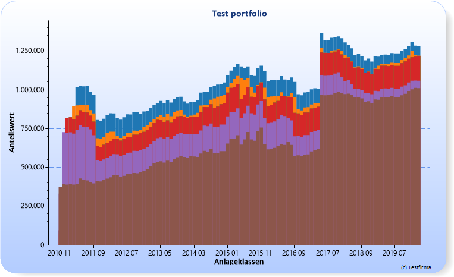
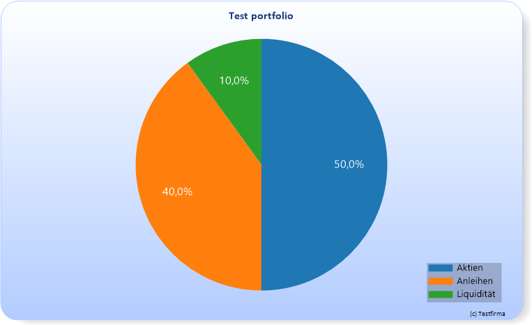
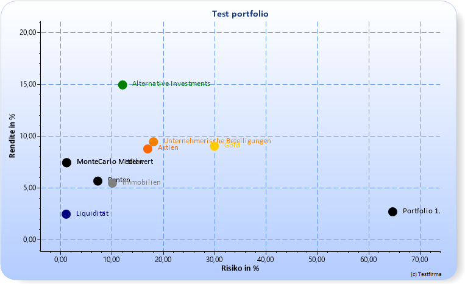

# What does the library

Bodoconsult.Core.Charting is a library for creating charts from database data. The workflow for using the library is generally as follows:

1. Getting data as DataTable from a database
2. Create a ChartData object to make general settings for the chart and load the data from the DataTable as List<IChartItemData> 
3. Create a ChartHandler and deliver the ChartData object to it
4. Export the data to a file

To work properly the DataTable objects must have a certain logical structure depending on the type of chart you want to create.

 

# How to use the library

The source code contains NUnit test classes the following source code is extracted from. The samples below show the most helpful use cases for the library.

## Chart data input

All chart types require a IList<IChartItemData> as input.

There are three classes implementing IChartItemData: ChartItemData, PieChartItemData and PointChartItemData. See the description for each chart type below for the required type of data input.


## Style the charts


Chart styling is based on the class ChartStyle from the library Bodoconsult.Core.Typography you can download via Nuget. See the following code fragments for how chart styling is done in the test project.


``` csharp

    public static class TestHelper
    {
		...
		
        /// <summary>
        /// Load a default style for the charts
        /// </summary>
        /// <param name="chartData"></param>
        /// <param name="highResolution"></param>
        public static void LoadDefaultChartStyle(ChartData chartData, bool highResolution = false)
        {

            var chartStyle = GlobalValues.DefaultTypography().ChartStyle;

            if (highResolution)
            {
                chartStyle.Width = 4500;
                chartStyle.Height = 2781;
                chartStyle.FontSize = 12;
            }

            chartStyle.CopyrightFontSizeDelta = 0.6F;
            chartStyle.BackgroundColor = Color.Transparent;
            //_chartStyle.AxisLineColor = Color.DarkBlue;

            //
            chartData.ChartStyle  = chartStyle;
            chartData.Copyright = "(c) Testfirma";

        }
		
		
	...
    }

```

``` csharp

    public static class GlobalValues
    {
        /// <summary>
        /// Get a elegant default typography
        /// </summary>
        /// <returns></returns>
        public static ITypography DefaultTypography()
        {
            var typography = new ElegantTypographyPageHeader("Calibri", "Calibri", "Calibri")
            {
                ChartStyle =
                {
                    Width = 750,
                    Height = 464,
                    FontSize = 10,
                    BackGradientStyle = GradientStyle.TopBottom,
                }
            };

            return typography;
        }

    }


```


## Line chart

### Sample image



### Chart data

ChartItemData class

### Code

``` csharp

			const string fileName = @"d:\temp\ScottPlott_LineChart.png";

            if (File.Exists(fileName)) File.Delete(fileName);

            var data = new ChartData
            {
                Title = "Test portfolio",
                Copyright = "Testfirma",
                XLabelText = "Anlageklassen",
                YLabelText = "Anteilwert",
                FileName = fileName,
                ChartType = ChartType.LineChart,
                //PaperColor = Color.Red
            };

            TestHelper.LoadDefaultChartStyle(data, HighResolution);

            TestDataHelper.ChartSample(UseDatabase, data);

            data.ChartStyle.XAxisNumberformat = "dd.MM.yyyy";

            data.PropertiesToUseForChart.Add("XValue");
            data.PropertiesToUseForChart.Add("YValue1");
            data.PropertiesToUseForChart.Add("YValue2");
            data.PropertiesToUseForChart.Add("YValue3");

            data.LabelsForSeries.Add("Aktien");
            data.LabelsForSeries.Add("Renten");
            data.LabelsForSeries.Add("Liquidität");

            var x = new ChartHandler
            {
                ChartData = data
            };

            x.Export();

```

### Bar chart

### Sample image



### Chart data

ChartItemData class


### Code

``` csharp

            const string fileName = @"d:\temp\ScottPlott_BarChart.png";

            if (File.Exists(fileName)) File.Delete(fileName);

            var data = new ChartData
            {
                Title = "Test portfolio",
                Copyright = "Testfirma",
                XLabelText = "Anlageklassen",
                YLabelText = "Anteil in %",

                FileName = fileName,
                ChartType = ChartType.BarChart,

            };

            TestHelper.LoadDefaultChartStyle(data, HighResolution);

            TestDataHelper.BarChartSample(UseDatabase, data);

            data.ChartStyle.XAxisNumberformat = "0.00";

            var x = new ChartHandler
            {
                ChartData = data
            };

            x.Export();

```

### Column chart

### Sample image



### Chart data

ChartItemData class


### Code

``` csharp

            const string fileName = @"d:\temp\ScottPlott_ColumnChart.png";

            if (File.Exists(fileName)) File.Delete(fileName);

            var data = new ChartData
            {

                Title = "Test portfolio",
                Copyright = "Testfirma",
                XLabelText = "Anlageklassen",
                YLabelText = "Anteil in %",


                FileName = fileName,
                ChartType = ChartType.ColumnChart,

            };

            TestHelper.LoadDefaultChartStyle(data, HighResolution);
            TestDataHelper.BarChartSample(UseDatabase, data);

            data.ChartStyle.YAxisNumberformat = "0.00";

            var x = new ChartHandler
            {
                ChartData = data
            };

            x.Export();

            TestHelper.StartFile(fileName);

```


### Stacked bar chart

### Sample image



### Chart data

ChartItemData class


### Code

``` csharp

            const string fileName = @"d:\temp\ScottPlott_Db_StackedBarChart.png";

            if (File.Exists(fileName)) File.Delete(fileName);

            var data = new ChartData
            {
                Title = "Test portfolio",
                Copyright = "Testfirma",
                XLabelText = "Anlageklassen",
                YLabelText = "Anteilswert",
                FileName = fileName,
                ChartType = ChartType.StackedBarChart,

            };

            TestHelper.LoadDefaultChartStyle(data);

            var dt = TestHelper.GetDataTable("StackedBarChart.xml");
            ChartUtility.DataTableToChartItemData(dt, "", data);

            var x = new ChartHandler
            {
                ChartData = data
            };

            x.Export();

```

### Stacked column chart

### Sample image



### Chart data

ChartItemData class


### Code

``` csharp

            const string fileName = @"d:\temp\ScottPlott_Db_StackedColumnChart.png";

            if (File.Exists(fileName)) File.Delete(fileName);

            var data = new ChartData
            {
                Title = "Test portfolio",
                Copyright = "Testfirma",
                XLabelText = "Anlageklassen",
                YLabelText = "Anteilswert",
                FileName = fileName,
                ChartType = ChartType.StackedColumnChart,

            };

            TestHelper.LoadDefaultChartStyle(data);

            var dt = TestHelper.GetDataTable("StackedColumnChart.xml");
            ChartUtility.DataTableToChartItemData(dt, "", data);

            var x = new ChartHandler
            {
                ChartData = data
            };

            x.Export();

```

## Stacked column chart 100%

### Sample image


### Chart data

ChartItemData class

### Code

``` csharp

             const string fileName = @"d:\temp\ScottPlott_Db_StackedColumn100Chart.png";

            if (File.Exists(fileName)) File.Delete(fileName);

            var data = new ChartData
            {
                Title = "Test portfolio",
                Copyright = "Testfirma",
                XLabelText = "Anlageklassen",
                YLabelText = "Anteilswert",
                FileName = fileName,
                ChartType = ChartType.StackedColumn100Chart,
            };

            TestHelper.LoadDefaultChartStyle(data);

            var dt = TestHelper.GetDataTable("StackedColumnChart.xml");
            ChartUtility.DataTableToChartItemData(dt, "", data);

            var x = new ChartHandler
            {
                ChartData = data
            };

            x.Export();

```

## Pie chart

### Sample image



### Chart data

PieChartItemData class

### Code

``` csharp

            const string fileName = @"d:\temp\ScottPlott_PieChart.png";

            if (File.Exists(fileName)) File.Delete(fileName);

            var data = new ChartData
            {
                Title = "Test portfolio",
                Copyright = "Testfirma",
                YLabelText = "Anteil in %",
                FileName = fileName,
                ChartType = ChartType.PieChart,
            };

            TestHelper.LoadDefaultChartStyle(data, HighResolution);

            TestDataHelper.PieChartSample(UseDatabase, data);

            var x = new ChartHandler
            {
                ChartData = data
            };

            x.Export();

```


## Point chart (risk-return-chart in finance)

### Sample image



### Chart data

PointChartItemData class

### Code

``` csharp

             const string fileName = @"d:\temp\ScottPlott_Db_StackedColumn100Chart.png";

            if (File.Exists(fileName)) File.Delete(fileName);

            var data = new ChartData
            {
                Title = "Test portfolio",
                Copyright = "Testfirma",
                XLabelText = "Anlageklassen",
                YLabelText = "Anteilswert",
                FileName = fileName,
                ChartType = ChartType.StackedColumn100Chart,
            };

            TestHelper.LoadDefaultChartStyle(data);

            var dt = TestHelper.GetDataTable("StackedColumnChart.xml");
            ChartUtility.DataTableToChartItemData(dt, "", data);

            var x = new ChartHandler
            {
                ChartData = data
            };

            x.Export();

```

# About us

Bodoconsult <http://www.bodoconsult.de> is a Munich based software company from Germany.

Robert Leisner is senior software developer at Bodoconsult. See his profile on <http://www.bodoconsult.de/Curriculum_vitae_Robert_Leisner.pdf>.

